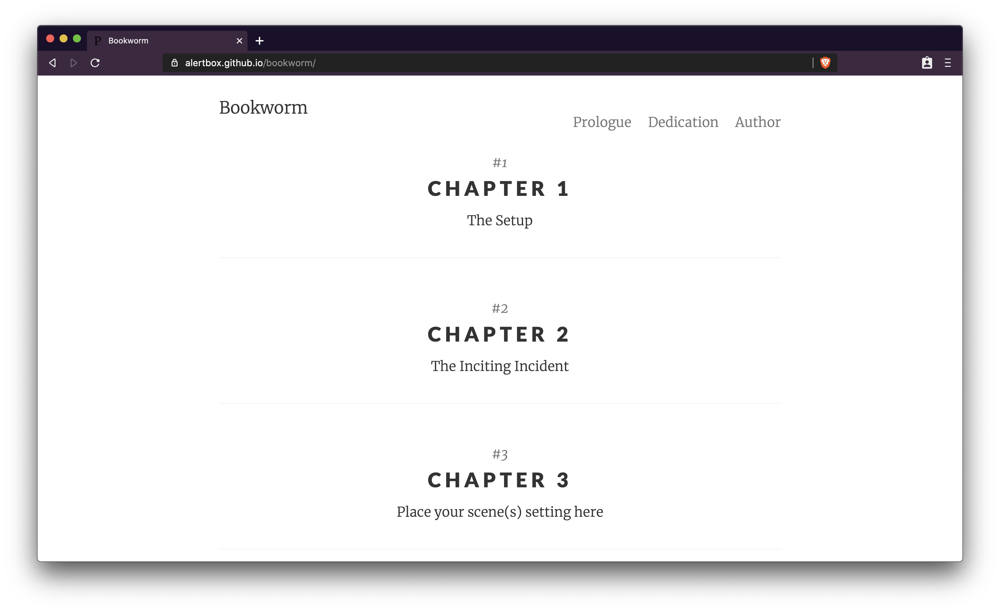

# Bookworm

[Bookworm](https://kosalanuwan.github.io/bookworm) is pretty minimal, but leverages large type and drastic contrast to make a statement, on all devices. It is a delightfully lightweight, mobile first, and fluidly responsive Jekyll theme for books and creative writing that emphasizes content rather than aesthetic fluff.

Originally, it was a duplicate of [Pixyll](https://github.com/johno/pixyll) crafted with :heart:. This repo is also a GitHub Page Template. Check out [the GitHub's Template Repositories](https://help.github.com/en/github/creating-cloning-and-archiving-repositories/creating-a-repository-from-a-template).



> The Bookworm in action.

## Content

- [Features](#features)
- [Requirements](#requirements)
- [Using This Theme](#using-this-theme)
- [Feedback](#feedback)
- [Contributing](#contributing)
- [License](#license)

## Features

- Best for GitHub Pages theme: `template` repo or `remote_theme`
- No need to install and setup Ruby and Jekyll locally
- Build and run locally
- Designed for mobile first and fluid responsive for all devices
- Customizable look and feel
- Built-in support for: PWA, Deep anchor links, and Telemetry
- Duplicated from the [Pixyll](https://pixyll.com) theme
- Powered by Jekyll and Docker Desktop

## Requirements

First, you will need followings to get started at the most basic level:

- [Docker Desktop]() for the minimum container requirements
- [Jekyll latest](), the magical GitHub Page website generator
- [Markdown](https://guides.github.com/features/mastering-markdown/), the lightweight and easy-to-use syntax for all forms of writing on GitHub platform

You will want to see the [hosted version](https://kosalanuwan.github.io/bookworm/) to have a feel of the most basic level.

## Using This Theme

If you're completely new to Jekyll, [Smashing Magazine tutorial on Jekyll](http://www.smashingmagazine.com/2014/08/01/build-blog-jekyll-github-pages/) is a good source to start with.

[Bookworm](https://kosalanuwan.github.io/bookworm) was a duplicate of [Pixyll](https://github.com/johno/pixyll), which provides a fully furnished documentation. See [the Pixyll Usage Guidelines](https://github.com/ashawley/pixyll/tree/gemspec#using-github-pages) to learn more.

Next, you want to create a copy of this template. The repository is marked as a `Template` so you will only have to [Use This Template](https://github.com/kosalanuwan/bookworm/generate/) and follow the instructions. Read more about this in [the GitHub's Template Repositories](https://help.github.com/en/github/creating-cloning-and-archiving-repositories/creating-a-repository-from-a-template) document.

That's it. You now have a Docker-enabled minimal GitHub repo, and is ready to preview locally.

### Preview Locally

First, you want to ensure Docker Desktop is running on your machine and the scripts are executable. See [troubleshooting](#troubleshooting). Then build and run the template locally.

```sh
#!/bin/bash
cd bookworm

./preview.sh -n bookworm-preview -p 8004 -v latest
```

Then, you launch your favorite browser and visit <https://localhost:8004/bookworm>.

### Troubleshooting

- Bash scripts getting terminated `Permission denied`
  > Make it executable with `chmod a+x ./preview.sh`

## Feedback

We would love for you to give all sorts of feedback. Here are the ways you can provide feedback:

- Ask a question on [Stack Overflow]()
- [Request a new feature](https://github.com/kosalanuwan/bookworm/issues/new?assignees=&labels=&template=feature_request.md&title=)
- Upvote [popular feature requests](https://github.com/kosalanuwan/bookworm/issues)
- [Report an issue](https://github.com/kosalanuwan/bookworm/issues/new?assignees=&labels=&template=bug_report.md&title=)
- Follow [@kosalanuwan](https://twitter.com/kosalanuwan) and let me know what you think!

## Contributing

There are many ways in which you can participate in the project. Please see the document [How to Contribute](CONTRIBUTING.md).

## License

Copyright (c) Kosala Nuwan Perera. All rights reserved.

The source code is license under the [MIT License](LICENSE).
